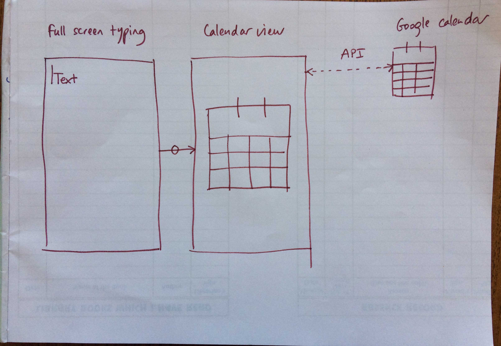
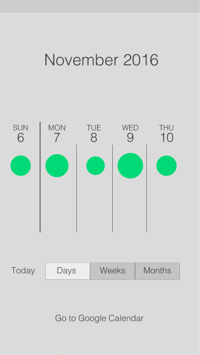
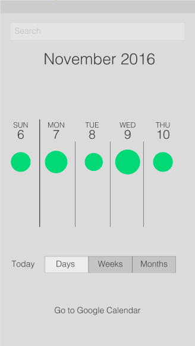
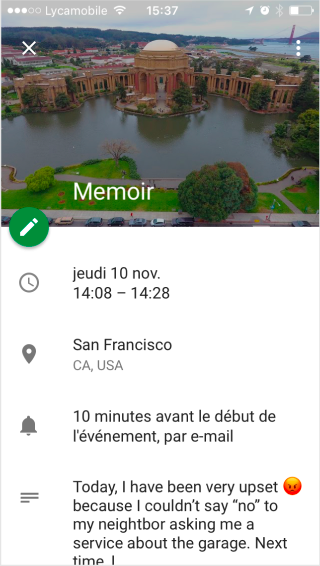
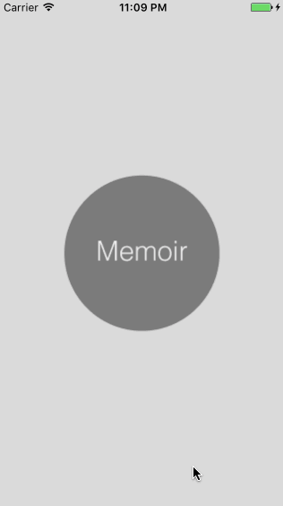

# Group Project: *Memoir*
++

**Memoir** has been programmatically animated with Swift (iOS) as a team project for [CodePath iOS for Designers](http://codepath.com/iosfordesigners).

### Team members
[**Monith Ilavarasan**](https://github.com/Monith)

[**Namrata Mohanty**](https://github.com/nmohanty)

[**Sophia Kecir Camper**](https://github.com/sophiakc)

### App Description
Personal diary attached to my calendar, using Google calendar API and a native calendar.

### Wireframes W3

### Wireframes W4

.png)

### User Stories
* [X] 1. "Start Writing" View Controller (initial View Controller)
    * [X] No Text Yet to Start Writing - Sophia
        * [X] As a new user, I see that I am going through "No Text Yet" and go straight to "Start Writing" - Sophia
        * [X] As a new user, I can UI Pan Gesture Left and see that I don't have any previous text entry (cf. Dropbox W1: http://courses.codepath.com/courses/ios_for_designers/unit/1#!assignment) - Sophia
        * [X] Automatically Select Text field and toggle keyboard when view loaded with textField.becomeFirstResponder() method - Sophia
        * [ ] Optional:
            * [ ] Reveal unlock icon + location and time button by following the toggle movement of keyboard (cf. W2 Assignment Carousel) - Sophia (ongoing)
            * [ ] When start scrolling, dismiss keyboard 
            * [ ] toggle keyboard back when: stop scrolling?
    
            * [X] UI Button for time and location - Sophia
                * [X] Push or Modal segue to Settings page and location enable popup - Sophia
                * [ ] Can dismiss the Settings page to go back
    
    * [ ] Unlock icon: 
        * [ ] Before performing Segue, when tapping on it, message pop up shows up: "Are you sure you have finished writing? You won't be able to edit this text again, it will be read only" - Sophia (ongoing)
        * [ ] Save text somewhere in a database?? as the latest text
        * [X] Push or Modal segue to next screen - Monith

* [ ] 2. Animation from "Start Writing" to "Read Only" View Controller
    * [ ] transition animation with lock icon full screen, then go to read only text
    * [X] UIScrollView with no icon - Sophia
    * [X] Pass text, word count and post count data to read and home screens - Namrata

* [ ] 3. "Read Only" VC
    * [ ] Has a container view to coordinate all the previous text written or the "not yet text" screen if first user
    * [ ] Horizontal scroll left to see previous written texts from the most recent to the last recent
    

* [ ] 4. Animation from any "Read Only" VC to the corresponding "Today" VC
    * [X] UI Pan Gesture down reveals "Today" VC - Namrata
    * [ ] The Read only text shrink into the Today small bubble view within the timeline - Namrata (ongoing)
    * [X] The number in the big bubbles updates based on the actual number of words written
    * [X] The number in the big bubbles updates based on the actual number of times a text has been written during the same day

* [ ] 5. "Today" View Controller
    * [ ] Vertical UIScrollView to bottom to see the different texts written per day in the timeline
    * [ ] Horizontal UIScrollView to left to see the text from the day before, and the day before..., one day = one screen
    * [ ] Horizontal UIScrollView to right go to a new "Start Writing" View Controller
    * [X] Compute and store the number in the big bubbles (nb of words, nb of times)
 
* [ ] 6. Animation from "Today" VC to "This Week" VC
	* [ ] UI Pan Gesture down goes to "This Week" VC
	* [ ] The big bubbles from Today shrink into smaller bubbles on the Week timeline table

* [ ] 7. "This Week" View Controller
    * [ ] Horizontal UIScrollView to see the different days of the month
    * [ ] Pan down to reveal search
    * [ ] from day to week view: shrink 7 columns into 1
    * [ ] from day to month view: shrink 30 columns into 1
    * [ ] from week to month view: shrink 4 columns into 1

* [ ] 8.Settings
    * [ ] Set up local time and location based on actual dataset up local time and location based on actual data
    * [ ] see where else to give access to it?

* [ ] 9. Launch screen
	* [ ] add and animate logo

* [ ] 10. Onboarding screens
    * [ ] Explain how it works
    * [ ] UIScrollView through the 3 onboarding screens

## Video Walkthrough

## Notes / Challenges encountered while building the app:

## License

    Copyright [2016] Memoir

    Licensed under the Apache License, Version 2.0 (the "License");
    you may not use this file except in compliance with the License.
    You may obtain a copy of the License at

        http://www.apache.org/licenses/LICENSE-2.0

    Unless required by applicable law or agreed to in writing, software
    distributed under the License is distributed on an "AS IS" BASIS,
    WITHOUT WARRANTIES OR CONDITIONS OF ANY KIND, either express or implied.
    See the License for the specific language governing permissions and
    limitations under the License.
